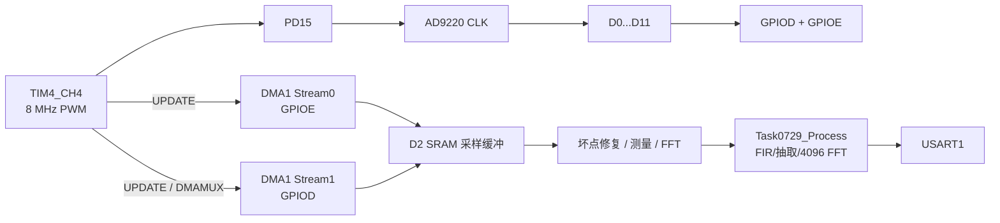

# STM32H743 + AD9220 周期信号测量与频谱分析

本工程使用 STM32H743 读取 AD9220 的 12 位并行输出，完成周期信号采集、幅值/频率测量、Simulink 生成算法的频谱分析和 THD 计算，并通过 USART1 输出结果。

当前版本已经移除 LCD 的运行路径：固件不初始化 LCD、不刷新屏幕，Makefile 也不再编译 LCD 驱动文件。工程中仍保留部分历史 LCD 源文件，便于追溯旧版本，但它们不参与当前固件。

## 当前配置

| 项目 | 配置 |
| --- | --- |
| MCU | STM32H743ZITx，Cortex-M7 |
| ADC | AD9220，12 位并行输出 |
| ADC 时钟 | PD15 / TIM4_CH4 |
| 采样率 | 固定 8 MSPS |
| 每块采样点数 | 16384 |
| 单块采集时间 | 2.048 ms |
| Simulink FFT | 4096 点（8 MSPS 输入经 4 倍抽取后为 2 MSPS） |
| Simulink 频率分辨率 | 488.28125 Hz |
| 频率分量个数 | 最多 3 个，由 Simulink 接口按题目要求输出 |
| Simulink 基波搜索范围 | 10 kHz 至 500 kHz（当前使用题目 3 模式） |
| 串口 | USART1，2,000,000 baud，8N1 |
| 配置保存 | 只有收到 `SAVE` 时写入 Flash |

## 运行结构



TIM4_CH4 在 PD15 上连续输出 8 MHz。AD9220 在时钟上升沿锁存输入，DMA 在后续 TIM4 更新事件读取 GPIO，避免 CPU 以 8 MHz 频率进入中断。每次 16384 点采样完成后，程序先修复异常点，再调用一次 `Task0729_Process()`；Simulink 代码在函数内部完成 64 阶 FIR、4 倍抽取和 4096 点 FFT。

Simulink 生成代码和稳定接口位于：

```text
Expand/Generated/Task0729/
Expand/Inc/task0729_processor.h
Expand/Src/task0729_processor.c
```

`Task0729_Process()` 是阻塞式块处理函数，只能在采样块完成后的主循环中调用，不能放进 DMA 中断。

## AD9220 引脚

| AD9220 信号 | STM32H743 |
| --- | --- |
| D0 | PD1 |
| D1 | PE8 |
| D2 | PE10 |
| D3 | PE12 |
| D4 | PE14 |
| D5 | PD8 |
| D6 | PE15 |
| D7 | PE13 |
| D8 | PE11 |
| D9 | PE9 |
| D10 | PE7 |
| D11 | PD0 |
| OTR / D12 | PD14 |
| CLK | PD15 / TIM4_CH4 |
| GND | 系统公共地 |

PD15 是当前固件的时钟输出端。不要把另一个有源时钟输出直接并接到 PD15/AD9220 CLK 网络上。

## USART1

| 信号 | 引脚 |
| --- | --- |
| TX | PA9 |
| RX | PA10 |
| 波特率 | 2,000,000 |
| 格式 | 8 数据位、无校验、1 停止位 |
| 流控 | 无 |

## 电压换算

AD9220 原始码按 12 位偏移二进制处理：

```text
raw = 0       -> -满量程
raw = 2048    -> 0 V
raw = 4095    -> +满量程
```

驱动内部转换为 Q15：

```c
signed_sample = (raw_code - 2048) << 4;
```

当前软件默认把 `-32768...+32767` 映射为约 `-2.5...+2.5 V`。如果前端有分压、放大或额外偏置，需要按实际模拟链路重新校准。

## 采集与异常点处理

- 每块采集 16384 点，采样率为 8 MSPS。
- DMA 缓冲放在 D2 SRAM 的 `.ad9220_dma_ram` 段。
- FFT 和测量使用的工作缓冲放在 AXI SRAM 的 `.scope_ram` 段。
- CPU 读取 DMA 缓冲前会执行 D-Cache 失效。
- 接近软件满量程的异常值会被判为坏点。
- 单个坏点使用前后有效点的均值修复；连续坏点使用线性插值。
- `GLITCH_FIX` 和 `BAD` 用于观察坏点修复数量。

## Simulink 频谱与谐波

自动摘要（`FFT ON`）使用刚引入的 `Task0729_Process()`。它接收 16384 个 8 MSPS 输入点，经 4 倍抽取后对 4096 点数据加 Hann 窗并进行 FFT，因此：

```text
df = 2,000,000 / 4,096 = 488.28125 Hz
```

摘要输出 Simulink 返回的最多 3 个频率分量（按频率排序），以及 `VPP`、`RMS`、基波峰值、基波频率和 THD。分量会按实际谐波次数显示，例如 `H1/H3/H5`，不要求连续。`WAVE` 是生成接口返回的波形点数（最多 600 点）。

自动摘要的 THD 按 Simulink 返回且能归入基波整数倍的高次分量计算：

```text
THD = sqrt(ΣAh²) / A1 × 100%
```

其中 `A1` 是基波峰值，日志里的 `A1` 和各个 `Hn` 单位都是 V。

## 串口命令

命令不区分大小写，每条命令以回车或换行结束。

| 命令 | 作用 |
| --- | --- |
| `HELP` | 显示当前可用命令 |
| `STATUS` | 输出采集、DMA、FFT 和串口状态 |
| `RATE 8000000` | 检查固定采样率；当前只接受 8000000 |
| `STREAM ON` | 开启周期性测量/FFT摘要输出 |
| `STREAM OFF` | 关闭周期性摘要输出 |
| `FFT ON` | 每个采样块调用 `Task0729_Process()` 并输出摘要 |
| `FFT OFF` | 停止自动 FFT，仅保留时域测量 |
| `DUMP` | 准备输出下一块 16384 点电压数据 |
| `SAVE` | 将当前串口配置写入 Flash |

以下旧版屏幕和完整频谱命令已经删除，不再接受：

```text
RUN
STOP
AUTO
CH
VDIV
CENTER
TIME
DEC
REFRESH
SPECTRUM
FFT FULL
```

### DUMP

发送：

```text
DUMP
```

正常响应：

```text
#OK DUMP ARMED
#DUMP BEGIN count=16384 fs=8000000Hz columns=voltage_V
0.0123
0.0246
...
#DUMP END
```

采集期间重复发送会得到：

```text
#ERR DUMP BUSY
```

### FFT 摘要

典型输出：

```text
#FFT seq=117 n=4096 fs=2000000Hz df=488.281Hz f0=500000.000Hz A1=0.063916V VPP=0.128000V RMS=0.045255V THD=19.0311% WAVE=600 BAD=0 T=45044us
H1=500000.000Hz/0.063916V H2=1000000.000Hz/0.003207V H3=1500000.000Hz/0.005118V
```

字段含义：

| 字段 | 含义 |
| --- | --- |
| `seq` | FFT 结果序号 |
| `n` | FFT 点数 |
| `fs` | 采样率 |
| `df` | 频率分辨率 |
| `f0` | 识别出的基波频率 |
| `A1` | 基波峰值 |
| `VPP` | Simulink 输出的峰峰值 |
| `RMS` | Simulink 输出的有效值 |
| `THD` | Simulink 返回的高次谐波相对基波的总失真 |
| `WAVE` | Simulink 输出波形点数 |
| `BAD` | 本块修复的异常点数 |
| `T` | `Task0729_Process()` 的 DWT 实测耗时，单位 µs |

## STATUS 诊断

典型状态：

```text
#SCOPE RATE=8000000Hz FS=8000000Hz SAMPLES=16384 OTR=0 GLITCH_FIX=0 CAP_ERR=0 MODE=TIM4_PWM_DMA DRV_ERR=0 ICACHE=ON DONE=3 ERR=0x0 STAGE=0 PROG=16384 CLK=L TIMEOUT=0 DT=30/30 STREAM=ON FFT=ON BAD=0 FFT_ERR=0 CFG=SAVED
```

重点字段：

| 字段 | 含义 |
| --- | --- |
| `RATE` | AD9220 时钟对应的目标采样率 |
| `FS` | 测量模块当前输入采样率 |
| `SAMPLES` | 已累计处理的采样点数 |
| `OTR` | AD9220 超量程累计次数 |
| `GLITCH_FIX` | 软件尖峰修复累计次数 |
| `CAP_ERR` | 采集启动或完成错误累计 |
| `ICACHE` | Cortex-M7 指令缓存状态，应为 `ON` |
| `DRV_ERR` | DMA 驱动错误累计 |
| `DONE` | DMA 完成标志位，Stream0 为 bit0、Stream1 为 bit1 |
| `ERR` | DMA 错误码 |
| `STAGE` | 驱动最近一次失败阶段 |
| `PROG` | 最近一次 DMA 进度 |
| `CLK` | 最近一次检测到的 AD9220 时钟电平 |
| `TIMEOUT` | 采集超时累计 |
| `DT/limit` | 两路 DMA 时间差及允许上限 |
| `STREAM` | 串口摘要输出开关 |
| `FFT` | 自动 FFT 开关 |
| `BAD` | 修复的坏点累计 |
| `FFT_ERR` | FFT 失败累计 |
| `CFG` | Flash 配置状态 |

排查顺序建议：

1. 先发送 `STATUS`，确认 `FS=8000000Hz`。
2. `CAP_ERR` 持续增加时，检查 AD9220 时钟、DMA 请求和数据线。
3. `DONE` 应同时包含两个 DMA 流的完成标志。
4. `GLITCH_FIX` 很大时，优先检查时钟边沿、数据线串扰、地线和输入信号幅度。
5. `FFT INVALID` 时，检查有效采样点数量、输入频率是否在搜索范围内，以及异常点是否过多。

## Flash 配置

配置区位于 STM32H743 Bank 2 Sector 7：

```text
起始地址：0x081E0000
大小：128 KiB
记录大小：64 字节
```

`SAVE` 使用追加记录方式写入，包含 CRC32 和递增序号。当前保留兼容旧版本的显示参数字段，但这些字段已经不再由命令修改，也不会影响采集和 FFT。串口摘要开关仍可通过 `STREAM ON/OFF` 修改，并在发送 `SAVE` 后保存。

## 编译与烧录

需要 GNU Make 和 Arm GNU Toolchain。工程根目录执行：

```powershell
make -j2
```

如果编译器不在 `PATH`：

```powershell
make GCC_PATH="C:/path/to/arm-gnu-toolchain/bin" -j2
```

清理构建：

```powershell
make clean
```

输出文件位于 `build/`：

```text
build/STM32H743.elf
build/STM32H743.hex
build/STM32H743.bin
build/STM32H743.map
```

可使用 STM32CubeProgrammer 烧录 `build/STM32H743.hex`，或：

```powershell
STM32_Programmer_CLI -c port=SWD -w build/STM32H743.hex -v -rst
```

上电后串口应先看到：

```text
#BOOT UART OK
#READY MODE=TIM4_PWM_DMA RATE=8000000Hz PROC=2000000Hz FFT=4096 DECIM=4 SIMULINK=1 ICACHE=ON
```

## 中断与工程目录

当前运行时主要使用：

- `DMA1_Stream0_IRQHandler`：GPIOE 数据 DMA 完成。
- `DMA1_Stream1_IRQHandler`：GPIOD 数据 DMA 完成。
- `TIM6_DAC_IRQHandler`：HAL 系统时基。

TIM4 不产生逐点 CPU 中断；USART1 命令采用轮询接收。历史 FreeRTOS 文件保留在工程目录中，但当前 Makefile 不编译它们。

核心文件：

```text
Core/Src/main.c                  初始化和主循环
Core/Src/scope_app.c             采集调度、命令解析和串口输出
Core/Src/usart.c                 USART1 配置
Expand/Src/ad9220.c              TIM4、GPIO DMA 和采样数据组装
Expand/Src/ad9220_spectrum.c     采样坏点检测与修复
Expand/Src/ad7606_scope.c        波形历史缓存和时域测量
Expand/Src/ad7606_scope_store.c  Flash 配置保存
STM32H743XX_FLASH.ld             Flash/RAM 链接布局
Makefile                         GCC 构建入口
```

修改采样率时，不能只修改串口显示值，还必须同步修改 TIM4 的时钟分频、FFT 使用的采样率以及 Flash 配置校验。
